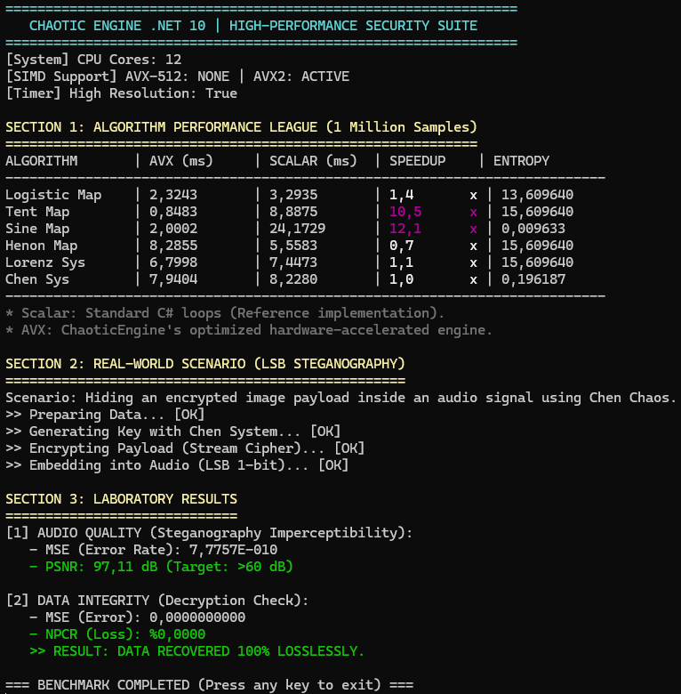

<div align="center">

# 🌌 ChaoticEngine
### High-Performance Chaos Theory & Security Library for .NET 10

[](https://dotnet.microsoft.com/download/dotnet/10.0)
[](https://en.wikipedia.org/wiki/Advanced_Vector_Extensions)
[](LICENSE)
[](https://www.nuget.org/)
[](https://github.com/umitkrkmz/ChaoticEngine)

<p align="center">
  <b>ChaoticEngine</b> is a research-grade library designed for <b>Cryptography</b>, <b>Steganography</b>, and <b>High-Entropy Simulations</b>.<br>
  It leverages modern .NET 10 intrinsics to unlock the full potential of your CPU using <b>AVX-512</b> and <b>AVX2</b> instruction sets.
</p>

[Features](#-key-features) •
[Benchmarks](#-performance-benchmarks) •
[Installation](#-installation) •
[Usage](#-usage) •
[Algorithms](#-supported-algorithms)

</div>

---

## 🚀 Key Features

### ⚡ Adaptive Hardware Acceleration
The engine automatically detects CPU capabilities at runtime and selects the fastest execution path without user intervention:
* **Gear 1: AVX-512 (512-bit)** - Processes **8** independent chaotic streams per cycle.
* **Gear 2: AVX2 (256-bit)** - Processes **4** independent chaotic streams per cycle.
* **Gear 3: Scalar Fallback** - Universal compatibility for older hardware.

### 🧮 Advanced Optimization Techniques
* **Interleaved Multi-State Simulation:** Overcomes the sequential dependency of chaos equations ($x_{n+1} = f(x_n)$) by simulating multiple independent "universes" in parallel vector lanes.
* **Branchless Logic:** Uses SIMD masking and blending instead of `if-else` branches (e.g., in Tent Map) to prevent CPU pipeline stalls.
* **Bhaskara Approximation:** Uses optimized algebraic approximations for trigonometric functions in SIMD (Sine Map) to avoid costly `Math.Sin` calls.

### 🛠️ Core Capabilities
* **🧬 Comprehensive Algorithm Suite:** Implements 6 distinct chaotic algorithms (1D Maps, 2D Attractors, 3D Differential Systems).
* **🛡️ Cryptographic Quality:** Validated high Shannon Entropy. Suitable for Stream Ciphers and PRNGs.
* **🕵️ Steganography Tools:** Built-in utilities for **LSB (Least Significant Bit)** data hiding with **Zero-Loss (MSE: 0.0)** recovery capability.
* **📊 Analysis Module:** Includes `QualityMetrics` for MSE, PSNR, RMSE, NPCR, and Entropy calculations.
* **🏭 Zero-Allocation Architecture:** Designed with `Span<T>` and `Memory<T>` for high-throughput, GC-friendly execution.
---

## 🏎️ Performance Benchmarks

ChaoticEngine is significantly faster than standard implementations, especially for 1D maps used in stream ciphers.

> **Note:** The **Sine Map** utilizes a specialized *Bhaskara I Approximation* with SIMD, achieving over **12x speedup** compared to `Math.Sin`.

### 📸 Live Benchmark Result (i7-9750H / AVX2 Active)



<details>
<summary><b>Click to see raw text output</b></summary>
<br>

```text
SECTION 1: ALGORITHM PERFORMANCE LEAGUE (1 Million Samples)
===========================================================
ALGORITHM       | AVX (ms)     | SCALAR (ms)  | SPEEDUP    | ENTROPY
---------------------------------------------------------------------------
Logistic Map    | 2.3243       | 3.2935       | 1.4      x | 13.609640
Tent Map        | 0.8483       | 8.8875       | 10.5     x | 15.609640
Sine Map        | 2.0002       | 24.1729      | 12.1     x | 0.009633
Henon Map       | 8.2855       | 5.5583       | 0.7      x | 15.609640
Lorenz Sys      | 6.7998       | 7.4473       | 1.1      x | 15.609640
Chen Sys        | 7.9404       | 8.2280       | 1.0      x | 0.196187
```
</details>

---

## 📦 Installation
This library is designed for **.NET 10.**
```bash
git clone https://github.com/umitkrkmz/ChaoticEngine.git
```
> **Note:** A generic NuGet package (ChaoticEngine) containing only the core libraries will be published soon. Currently, please clone the repository to run benchmarks.

---

## 💻 Usage
**1. Generating Chaos (The Factory Pattern)**\
You don't need to worry about hardware support; the factory handles it.

```csharp
using ChaoticEngine.Core;

// Create a generator (Auto-detects AVX-512/AVX2)
var engine = ChaosFactory.Create1D(ChaosType.SineMap);

// Generate 1 Million chaotic numbers
double[] buffer = new double[1_000_000];
engine.Generate(buffer, initialCondition: 0.5);
```

**2. Signal Analysis & Quality Control**\
Perfect for verifying Steganography or Image Encryption results.

```csharp
using ChaoticEngine.Analysis;

double[] original = LoadAudio("cover.wav");
double[] stego    = LoadAudio("stego.wav");

// Calculate Imperceptibility (PSNR)
double mse  = QualityMetrics.CalculateMse(original, stego);
double psnr = QualityMetrics.CalculatePsnr(mse, maxValue: 2.0);

Console.WriteLine($"PSNR: {psnr} dB"); // > 60 dB is invisible to human perception
```

---

## 🧠 Supported Algorithms

| Type     | Algorithm              | Chaos Characteristics                 | Best Use Case                  |
|----------|------------------------|---------------------------------------|--------------------------------|
| **1D**   | **🌪️Logistic Map**     | Polynomial, Population dynamics       | Fast PRNG, Basic Encryption    |
| **1D**   | **⛺Tent Map**         | Piecewise Linear                      | High-Speed Stream Ciphers      |
| **1D**   | **〰️Sine Map**          | Trigonometric (Highly Non-linear)     | **Ultra-Fast** (via SIMD Hack) |
| **2D**   | **🌀Henon Map**        | Quadratic, Strange Attractor          | Image Encryption, Data Hiding  |
| **3D**   | **🦋Lorenz System**    | Differential, Butterfly Effect        | Modeling, Key Generation       |
| **3D**   | **🐉Chen System**      | Differential, Double Scroll           | High-Sensitivity Crypto        |

---

## 📄 License
Distributed under the MIT License. See [`LICENSE`](LICENSE) for more information.