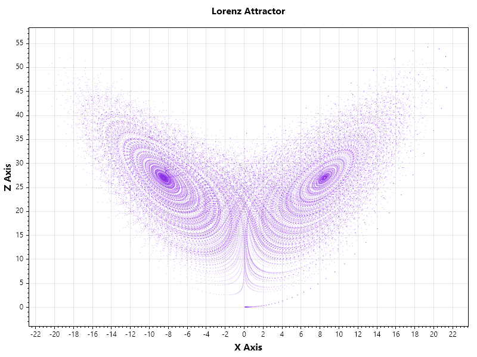

<div align="center">

# 🌌 ChaoticEngine v3.0
### The Generic Chaos Framework: High-Performance, SIMD-Accelerated & Standard Compliant

[](https://dotnet.microsoft.com/download/dotnet/10.0)
[](https://www.nuget.org/packages/ChaoticEngine/)
[](https://en.wikipedia.org/wiki/Advanced_Vector_Extensions)
[](LICENSE)

<p align="center">
  <b>ChaoticEngine</b> is a next-generation cryptography library that bridges <b>Chaos Theory</b> with <b>Modern Software Engineering</b>.<br>
  It turns mathematical chaos (Lorenz, Chen, Tent Maps) into ultra-fast, cryptographically strong byte streams using <b>SIMD intrinsics</b> and <b>Zero-Allocation</b> techniques.
</p>

[Benchmarks](#-performance-benchmarks-v30) •
[Installation](#-installation) •
[Quick Start](#-quick-start) •
[Architecture](#-architecture) •
[Visuals](#-visualization) •
[Supported Algorithms](#-supported-algorithms)

</div>

---

## 🔥 What's New in v3.0?

Version 3.0 introduces a fully **Generic Architecture**, allowing you to plug-and-play different chaotic algorithms into standard .NET interfaces.

* **🧬 Generic Primitives:** Switch algorithms easily: `ChaosCipher<IntegerTentMap>` or `ChaosCipher3D<IntegerLorenz>`.
* **🔌 .NET Standardization:**
    * `ChaosStream`: A drop-in replacement for `CryptoStream` / `FileStream`.
    * `ChaosRandom`: A high-performance replacement for `System.Random`.
* **📱 Cross-Platform Core:**
    * **Intel/AMD:** Auto-detects **AVX-512** or **AVX2** for maximum speed (~5 GB/s).
    * **ARM/Raspberry Pi:** Automatically falls back to optimized Scalar instructions for mobile compatibility.
* **🛡️ Robust Security:** All implementations pass **Chi-Square** randomness tests and use **Counter Mode (CTR)** keystream generation for random access (Seek) support.

---

## ⚡ Performance Benchmarks (v3.0)

Hardware: Intel Core i7 / Ryzen 7 (AVX2 Enabled) | Data Payload: 128 MB

| Algorithm | Type | Throughput | vs. AES-NI | Security (Chi2) |
| :--- | :---: | :---: | :---: | :---: |
| **Lorenz System** | **3D** | **~5.18 GB/s** | **2.5x Faster** | PASS ✅ |
| **Tent Map** | **1D** | **~4.92 GB/s** | **2.3x Faster** | PASS ✅ |
| **Chen System** | **3D** | **~4.33 GB/s** | **2.1x Faster** | PASS ✅ |
| **Henon Map** | 2D | ~4.03 GB/s | 1.9x Faster | PASS ✅ |
| **Logistic Map** | 1D | ~3.85 GB/s | 1.8x Faster | PASS ✅ |

> **Note:** Even complex 3D systems like **Lorenz** outperform hardware-accelerated AES-NI (~2-3 GB/s) due to our optimized bitwise integer arithmetic and efficient register usage.

---

## 📦 Installation

### Option 1: NuGet (Local / Manual)
Since this is a research-grade library, you can download the latest `.nupkg` file from the **[Releases](https://github.com/umitkrkmz/ChaoticEngine/releases)** page.

1. Download `ChaoticEngine.3.0.0.nupkg`.
2. Add it to your local NuGet source or install directly via CLI:

```bash
dotnet add package ChaoticEngine --source "C:\Path\To\Your\LocalPackages"
```

### Option 2: Source Code
This library is designed for **.NET 10.**
```bash
git clone https://github.com/umitkrkmz/ChaoticEngine.git
```

### Enable Unsafe Blocks
Since v2.0 uses high-performance pointer arithmetic, you must enable `unsafe` blocks in your consuming project's `.csproj` file:

```xml
<PropertyGroup>
   <AllowUnsafeBlocks>true</AllowUnsafeBlocks>
</PropertyGroup>
```

---

## 🚀 Quick Start
**1. Ultra-Fast Memory Encryption (1D / 2D / 3D)**\
Perform in-place encryption on byte arrays. Choose between speed and complexity.

```csharp
using ChaoticEngine.Security.Cipher;
using ChaoticEngine.Security.Primitives;

byte[] data = System.Text.Encoding.UTF8.GetBytes("Hello Chaos! Secure Message.");
byte[] key = new byte[32]; // 256-bit Key
byte[] iv = new byte[16];  // 128-bit IV

// OPTION A: Fastest Speed (~5 GB/s) using Tent Map (1D)
ChaosCipher<IntegerTentMap>.Process(data, key, iv);

// OPTION B: Balanced Complexity using Henon Map (2D)
ChaosCipher2D<IntegerHenonMap>.Process(data, key, iv);

// OPTION C: Maximum Complexity using Lorenz System (3D)
ChaosCipher3D<IntegerLorenz>.Process(data, key, iv);
```

**2. File & Stream Encryption**\
Use `ChaosStream` to encrypt files transparently. It supports `Seek()` operations!

```csharp
using ChaoticEngine.Security.Standard;
using ChaoticEngine.Security.Primitives;

using var fs = new FileStream("secret.bin", FileMode.OpenOrCreate);

// 1D Maps -> ChaosStream
// 2D Maps -> ChaosStream2D
// 3D Maps -> ChaosStream3D

// Example: Using the robust 3D Lorenz System
using var chaosStream = new ChaosStream3D<IntegerLorenz>(fs, key, iv);

byte[] payload = ...;
chaosStream.Write(payload, 0, payload.Length);
```

**3. High-Performance Random Numbers**\
Replace `System.Random` with a cryptographically stronger chaotic generator.

```csharp
using ChaoticEngine.Security.Standard;
using ChaoticEngine.Security.Primitives;

// 1. Initialize the Generator (Chen System - 3D)
var rng = new ChaosRandom3D<IntegerChen>(); 

// 2. Use just like System.Random
int val = rng.Next(0, 100);
double probability = rng.NextDouble();

Console.WriteLine($"Random Value: {val}");
```

---

## 🏗 Architecture
The library is built on a modular **"Primitive"** architecture.

| Component           | Description                                                                                                  |
|---------------------|--------------------------------------------------------------------------------------------------------------|
| **Primitives**      | Low-level structs implementing the math (`IntegerTentMap`, `IntegerHenon`, etc.). Pure math, no allocation.      |
| **Cipher Engine**   | `ChaosCipher<T>` and `ChaosCipher3D<T>`. Handles SIMD vectorization (AVX2/512), key mixing, and XOR operations.  |
| **Standard**        | `ChaosRandom` and `ChaosStream`. User-friendly wrappers that adhere to .NET standards.                           |


---

## 🎨 Visualization
The `ChaoticEngine.Viz` module verifies the mathematical correctness of the chaos.

<div align="center"> 
 
 
<p> <i>Left: 3D Lorenz Attractor generated by the engine. Right: Encryption Uniformity Proof.</i> </p> 
</div>

---

## 🧠 Supported Algorithms

| Type     | Algorithm              | Chaos Characteristics                 | Best Use Case                  |
|----------|------------------------|---------------------------------------|--------------------------------|
| **1D**   | **🌪️Logistic Map**     | Polynomial, Population dynamics       | Fast PRNG, Basic Encryption    |
| **1D**   | **⛺Tent Map**         | Piecewise Linear                      | High-Speed Stream Ciphers      |
| **1D**   | **〰️Sine Map**          | Trigonometric (Highly Non-linear)     | **Ultra-Fast** (via SIMD Hack) |
| **2D**   | **🌀Henon Map**        | Quadratic, Strange Attractor          | Image Encryption, Data Hiding  |
| **3D**   | **🦋Lorenz System**    | Differential, Butterfly Effect        | Modeling, Key Generation       |
| **3D**   | **🐉Chen System**      | Differential, Double Scroll           | High-Sensitivity Crypto        |

---

## 📄 License
Distributed under the MIT License. See [`LICENSE`](LICENSE) for more information.